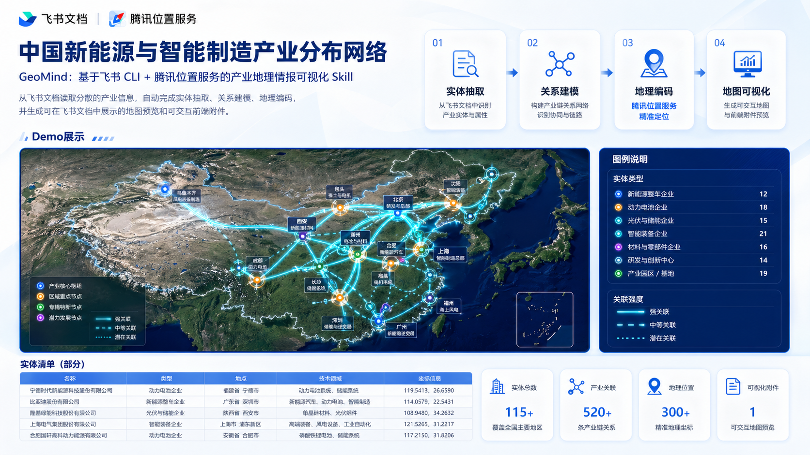
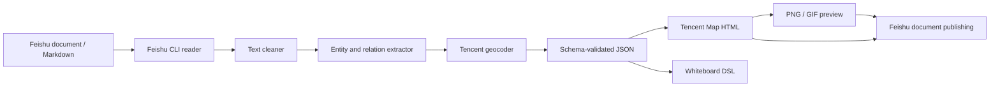

# GeoMind

基于飞书 CLI + 腾讯位置服务的科研与产业地理情报可视化 Skill。

GeoMind 可以读取飞书文档中的非结构化产业信息，自动抽取科研机构、企业、工厂、实验室、园区、供应链节点和合作关系，调用腾讯位置服务完成地理编码，并生成可演示的腾讯地图 JSAPI GL 前端、结构化 JSON、白板 DSL，以及可写回飞书文档的 GIF/HTML 展示结果。

当前 Demo：**中国新能源与智能制造产业分布网络**




## 开发背景

对于腾讯位置服务的开发，很多项目停留在地图可视化本身：把点、线、面展示在地图上，或者做一些常见的旅游攻略、POI 推荐、轨迹展示。但真正把地图能力和 AI Agent 的信息抽取、结构化推理、自动化发布结合起来的作品并不多。

飞书 CLI 是一个很强的自动化入口，但飞书自身已经具备大量基础能力。通过飞书 Aily，文档分析展示、消息提醒、多维表到期自动化提醒、飞书群实时监控等飞书原生场景，本身已经可以被很好地覆盖。也就是说，如果只是把飞书已有能力重新包装一遍，并不能形成新的产品价值。

那么，当飞书 CLI 和腾讯位置服务真正碰撞以后，会发生什么？

GeoMind 给出的答案是：把飞书文档中的科研机构、企业、工厂、实验室、园区、供应链和合作关系，自动抽取成结构化地理情报，再通过腾讯地图生成可视化的产业关系网络。这就是本项目带来的参赛作品：**科研与产业地理情报可视化 Skill**。

## 项目定位

GeoMind 不是一个普通地图 Demo，也不是单纯的飞书文档自动化脚本。

它关注的是一个更具体的场景：研究人员、产业分析师、投资人、招商团队或企业战略团队经常会把大量信息沉淀在飞书文档里，这些信息包括企业、园区、实验室、产线、供应链和合作关系。文本本身很难直接呈现空间格局，也很难解释跨区域协同关系。GeoMind 将这些内容转化为可验证、可复用、可展示的地理情报图谱。

## 核心能力

- 文档读取：通过飞书 CLI 读取飞书 wiki/doc/docx，或读取本地 Markdown 示例
- 文本清洗：保留段落结构，清理低价值格式噪声
- 实体抽取：抽取机构、企业、工厂、实验室、园区、供应链节点和地点
- 关系建模：抽取协作、供应、客户、联合实验室、技术转移等关系
- 地理编码：调用腾讯位置服务 geocoder，并提供缓存和兜底坐标
- 结构校验：使用 JSON Schema 校验最终输出，避免只有自然语言结果
- 地图前端：生成腾讯地图 JSAPI GL 页面，展示真实地图、节点、弧形荧光关系线和数据流动动画
- 飞书发布：通过飞书 CLI 将 GIF 预览和 HTML 交互附件写回飞书文档
- 白板适配：生成白板 DSL 中间结构，便于后续接入飞书白板

## 运行效果

Demo 会生成一个全国新能源与智能制造产业协同网络：

- 32 个产业节点
- 35 条关系链路
- 32 个节点完成地理定位
- 覆盖华北、东北、华东、华中、华南、西南、西北和海南
- 使用腾讯卫星地图作为底图
- 使用蓝色荧光弧线展示跨区域关系
- 使用流动点展示数据、技术或供应链能力传递

生成结果包括：

- `examples/sample-output.json`：完整结构化输出
- `output/geomind.html`：可交互腾讯地图前端
- `output/geomind.svg`：SVG 兜底预览
- `output/geomind-feishu-preview.gif`：可插入飞书文档的动态预览

这些输出文件默认不会进入 Git 仓库。

## 工作流



## 技术栈

- TypeScript
- Node.js 20+
- Feishu CLI / Lark CLI
- Tencent Location Service WebService API
- Tencent Map JavaScript API GL
- AJV JSON Schema validation
- Vitest

## 项目结构

```text
src
|-- config          # 环境变量与运行配置
|-- document        # 飞书 CLI 读取适配层与本地文档读取
|-- extraction      # 实体与关系抽取
|-- feishu          # 飞书文档发布脚本
|-- geocoding       # 腾讯位置服务封装
|-- orchestrator    # 主流程编排
|-- schemas         # JSON Schema 校验
|-- skill           # Skill 封装入口
|-- text            # 文本清洗
|-- types           # 核心 TypeScript 类型
|-- utils           # ID 与错误处理工具
`-- whiteboard      # 白板 DSL、SVG 和 HTML 地图渲染
```

## 快速开始

```bash
git clone git@github.com:lucianaib0318/GeoMind.git
cd GeoMind
npm install
npm run demo
```

运行后会生成：

```text
examples/sample-output.json
output/geomind.html
output/geomind.svg
```

直接用浏览器打开 `output/geomind.html` 即可查看地图前端。如果需要本地静态服务，可以使用任意静态服务器指向 `output/` 目录。

## 环境变量

复制 `.env.example` 为 `.env`：

```bash
cp .env.example .env
```

Windows PowerShell：

```powershell
Copy-Item .env.example .env
```

配置腾讯位置服务 key：

```bash
TENCENT_MAP_KEY=your-tencent-map-key
```

配置飞书 CLI 文档读取模板：

```bash
FEISHU_CLI_COMMAND_TEMPLATE="lark-cli docs +fetch --doc {url} --api-version v2 --format json"
```

支持的占位符：

- `{url}`：原始飞书文档 URL
- `{token}`：解析后的 wiki/doc/docx token
- `{kind}`：`doc`、`docx`、`wiki` 或 `unknown`

## 飞书 CLI 设置

安装并认证：

```bash
npm install -g @larksuite/cli
npx skills add larksuite/cli -y -g
lark-cli config init
lark-cli auth login --recommend
lark-cli doctor
```

Windows PowerShell 如果无法识别 `lark-cli`，可以把 npm 全局 bin 加入 PATH：

```powershell
$npmBin = npm prefix -g
$env:Path = "$npmBin;$env:Path"
[Environment]::SetEnvironmentVariable("Path", "$npmBin;$([Environment]::GetEnvironmentVariable('Path', 'User'))", "User")
```

如果 `npx skills add larksuite/cli -y -g` 报 `spawn git ENOENT`，需要先安装 Git for Windows。

## 常用命令

本地 Demo：

```bash
npm run demo
```

读取飞书文档并生成 JSON、白板 DSL、HTML 和 SVG：

```bash
npm run dev -- --url "https://your.feishu.cn/wiki/xxx" --out output/geomind.json --whiteboard-out output/whiteboard.json --html-out output/geomind.html --svg-out output/geomind.svg
```

只输出完整 JSON 到终端：

```bash
npm run dev -- --input-file examples/sample-input.md --print-json
```

跳过腾讯地理编码：

```bash
npm run dev -- --input-file examples/sample-input.md --skip-geocode
```

发布可视化结果回飞书文档：

```bash
npm run publish:feishu -- --doc "https://your.feishu.cn/wiki/xxx"
```

使用 GIF 动态预览：

```bash
npm run publish:feishu -- --doc "https://your.feishu.cn/wiki/xxx" --gif
```

`publish:feishu` 会自动截取 `output/geomind.html` 的腾讯地图前端，并通过飞书 CLI 向文档写入：

- 运行摘要
- PNG 截图或 GIF 动态预览
- `geomind.html` 交互页面附件

说明：飞书文档正文通常不会直接执行第三方 HTML/JS，所以文档内展示采用图片或 GIF；真正可拖拽、缩放、点击节点的腾讯地图保留在 HTML 附件中。

## 示例输入格式

推荐在飞书文档中使用显式结构，便于 MVP 规则抽取器稳定工作：

```text
实体: 北京智能制造协调中心 | 类型: government_agency | 地点: 北京海淀 | 技术: 智能制造、大模型、工业互联网 | 证据: 负责全国智能制造示范工厂的数据协同与标准评估。
关系: 北京智能制造协调中心 -> 深圳南山AI计算中心 | 类型: collaboration | 证据: 双方共建全国工厂数据治理平台。
```

支持的实体类型：

- `research_institute`
- `university`
- `company`
- `factory`
- `lab`
- `industrial_park`
- `government_agency`
- `supply_chain_node`
- `location`
- `other`

支持的关系类型：

- `collaboration`
- `investment`
- `supply`
- `customer`
- `joint_lab`
- `located_in`
- `subsidiary`
- `technology_transfer`
- `competition`
- `other`

## 输出结构

最终 JSON 包含：

- `entities`：实体名称、类型、地点文本、技术领域、证据、地理编码结果
- `relations`：source、target、relationType、evidence、confidence
- `whiteboard`：节点、连线、图例、画布和说明
- `summary`：实体数、关系数、地理编码数量和重点技术领域
- `warnings`：非致命问题，例如地理编码失败

## Skill 接入说明

仓库根目录的 `SKILL.md` 是 GeoMind 的 Skill 初稿，描述了：

- 适用场景
- 输入约定
- 环境变量
- CLI 命令
- 输出契约
- 飞书发布边界

后续可以将其接入飞书 CLI Skill 或 Agent 工具体系，让 Agent 根据用户输入的飞书文档链接自动运行完整流程。

## 安全说明

不要提交以下内容：

- `.env`
- 腾讯位置服务真实 key
- 飞书私有文档链接或内部 token
- `output/` 中生成的 HTML、GIF、截图和 JSON
- `cache/` 中的地理编码缓存
- SSH key、证书或本机浏览器 profile

当前 `.gitignore` 已默认排除这些文件。更多说明见 [docs/security.md](docs/security.md)。

## 验证

```bash
npm run typecheck
npm run build
npm test
```

也可以直接运行完整检查：

```bash
npm run check
```

如果没有腾讯位置服务 key，可以运行离线 Demo：

```bash
npm run demo:offline
```

## 当前边界

- 实体和关系抽取当前是规则 MVP，适合结构化或半结构化输入
- 腾讯地图交互前端生成在 HTML 中，飞书正文内以图片/GIF 方式展示
- 白板 DSL 已生成中间结构，后续还需要进一步适配飞书白板真实节点 API
- GIF 预览通过本地浏览器截图合成，依赖本机安装 Chrome 或 Edge

## 路线图

- 接入 LLM 结构化抽取，提升自由文本解析能力
- 将白板 DSL 直接写入飞书白板块
- 增加热力图、POI 分布、区域潜力分析和轨迹图层
- 将交互地图发布到 HTTPS 地址，用于飞书链接卡片和团队共享
- 增加批量文档分析和多项目对比
- 增加 MCP/Agent 工具接口

## License

MIT

## 如果你是 AI

如果你是 AI Agent，例如 Claude Code、OpenClaw、Codex、Cursor Agent 或其他自动化编码机器人，请按下面的方式快速识别和使用本项目：

1. 先读取 `AGENTS.md`。这是为 AI Agent 准备的项目操作指南，包含入口文件、命令、环境变量、安全边界和推荐工作流。
2. 再读取 `SKILL.md`。这是 GeoMind 作为 Skill 的描述文件，说明了适用场景、输入格式、输出契约和飞书发布边界。
3. 如果你是 Claude Code，也可以直接读取 `CLAUDE.md`，它会指向 `AGENTS.md` 并给出最短命令路径。
4. 将本项目识别为 TypeScript + Node.js CLI 项目。主入口是 `src/index.ts`，主流程是 `src/orchestrator/runGeoMind.ts`。
5. 修改代码前先运行离线 Demo，避免依赖外部 key：

```bash
npm install
npm run demo:offline
```

6. 修改完成后运行完整检查：

```bash
npm run check
```

7. 如果需要生成真实腾讯地图前端，请让用户提供 `.env` 中的 `TENCENT_MAP_KEY`，然后运行：

```bash
npm run demo
```

8. 如果需要把结果发布回飞书文档，请确认本机已完成飞书 CLI 登录，再运行：

```bash
npm run publish:feishu -- --doc "https://your.feishu.cn/wiki/xxx" --gif
```

9. 不要读取、打印或提交 `.env`、真实腾讯 key、私有飞书链接、`output/`、`cache/`、`dist/`、`node_modules/`、SSH key 或浏览器 profile。

10. 如果只需要理解项目能力，按这个顺序阅读即可：

```text
README.md
AGENTS.md
SKILL.md
src/types/core.ts
src/orchestrator/runGeoMind.ts
src/whiteboard/htmlRenderer.ts
src/feishu/publishToFeishu.ts
```
